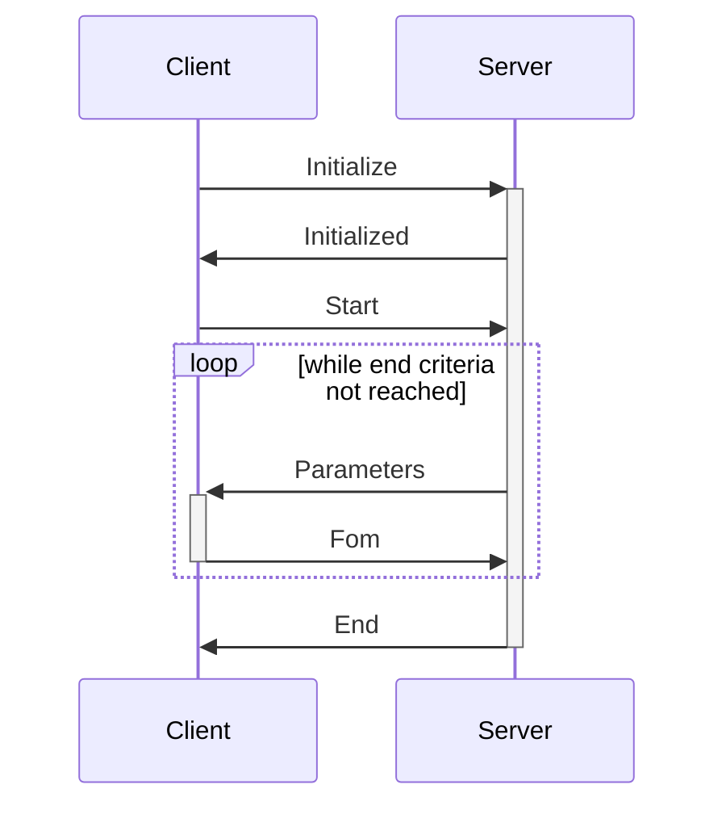

# Calibration Protocol #

Calibration session protocol: 

```gRPC
// The qserve service definition.
service QCalibrate {
  // submits a task and return a result
  rpc CreateExperiment (CreateExperimentRequest) returns (CreateExperimentResponse);
  rpc Run (stream Request) returns (stream Response);
}
```


